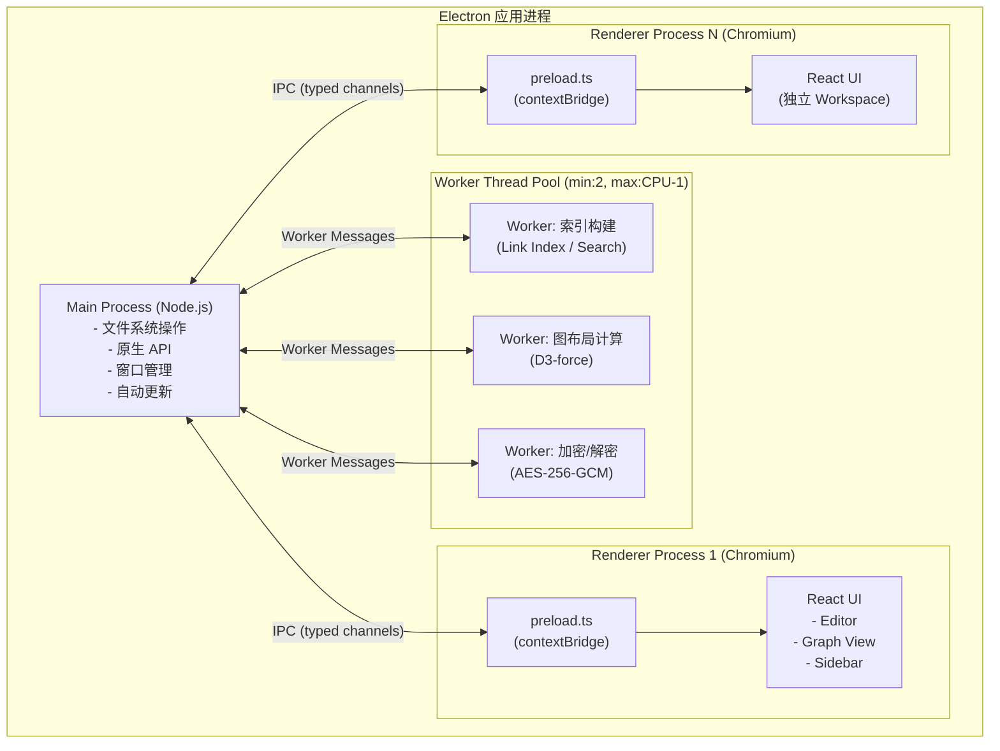
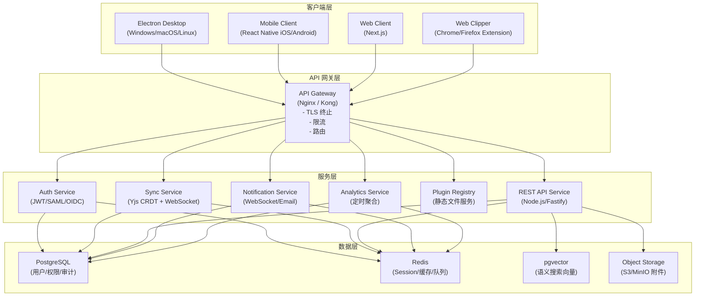
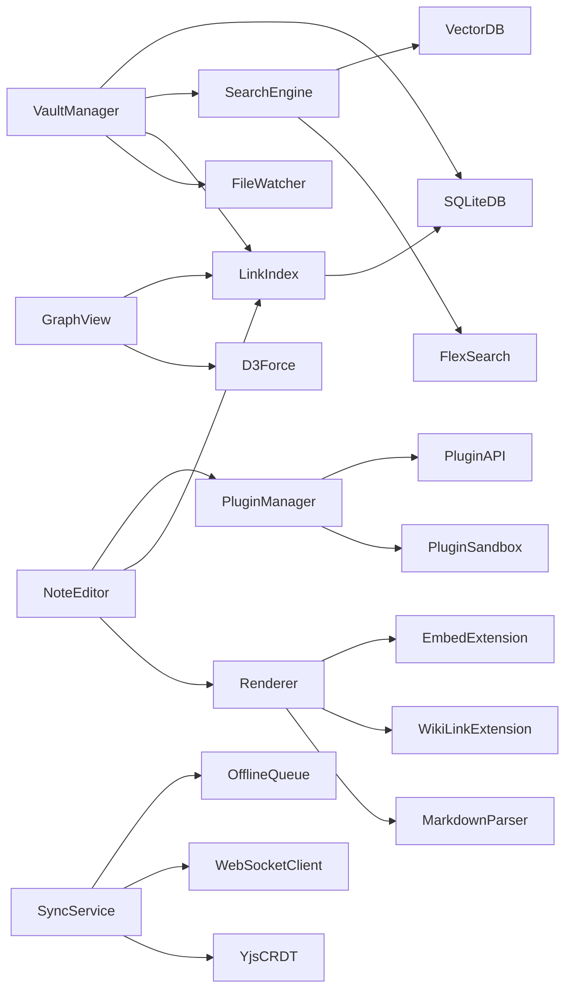

# 企业级知识管理系统（EKM）技术设计文档

> **Feature:** enterprise-knowledge-management  
> **Workflow:** Requirements-First  
> **版本:** 1.0.0  
> **状态:** 草稿

---

## 目录

1. [概述（Overview）](#1-概述)
2. [系统架构总览](#2-系统架构总览)
3. [技术选型](#3-技术选型)
4. [数据模型（Data Models）](#4-数据模型)
5. [本地文件系统架构](#5-本地文件系统架构)
6. [Markdown 渲染机制](#6-markdown-渲染机制)
7. [双向链接实现方案](#7-双向链接实现方案)
8. [Graph View 实现方案](#8-graph-view-实现方案)
9. [插件系统设计](#9-插件系统设计)
10. [搜索系统设计](#10-搜索系统设计)
11. [多端同步架构](#11-多端同步架构)
12. [Electron IPC 架构设计](#12-electron-ipc-架构设计)
13. [企业权限系统设计](#13-企业权限系统设计)
14. [项目目录结构](#14-项目目录结构)
15. [核心模块接口定义](#15-核心模块接口定义)
16. [正确性属性（Correctness Properties）](#16-正确性属性)
17. [错误处理（Error Handling）](#17-错误处理)
18. [测试策略（Testing Strategy）](#18-测试策略)
19. [MVP 最小可行版本范围](#19-mvp-最小可行版本范围)
20. [企业级可扩展架构方案](#20-企业级可扩展架构方案)

---

## 1. 概述

企业级知识管理系统（EKM）是一套以本地 Markdown 文件为核心数据载体的桌面知识管理平台，功能对标 Obsidian，并在其基础上扩展多用户协作、权限管理、私有化部署、团队知识库等企业级能力。

**核心设计原则：**
- 本地文件优先：所有笔记以纯文本 `.md` 文件存储，数据可移植
- 离线优先：核心功能在无网络环境下完整可用
- 安全边界清晰：Electron 主进程/渲染进程严格隔离，插件沙箱化
- 企业级可扩展：RBAC 权限、SSO 集成、私有化部署、审计日志

企业级知识管理系统（EKM）是一套以本地 Markdown 文件为核心数据载体的桌面知识管理平台，功能对标 Obsidian，并在其基础上扩展多用户协作、权限管理、私有化部署、团队知识库等企业级能力。

**核心设计原则：**
- 本地文件优先：所有笔记以纯文本 `.md` 文件存储，数据可移植
- 离线优先：核心功能在无网络环境下完整可用
- 安全边界清晰：Electron 主进程/渲染进程严格隔离，插件沙箱化
- 企业级可扩展：RBAC 权限、SSO 集成、私有化部署、审计日志

---

## 2. 系统架构总览

### 2.1 Electron 进程架构



### 2.2 客户端 + 服务端整体架构



### 2.3 模块依赖关系



---

## 3. 技术选型

### 3.1 桌面端

| 技术 | 版本 | 用途 |
|------|------|------|
| Electron | 30.x | 桌面应用框架 |
| React | 18.x | UI 框架 |
| TypeScript | 5.x | 类型安全 |
| CodeMirror 6 | 6.x | 核心编辑器 |
| Vite | 5.x | 渲染进程构建 |
| electron-builder | 24.x | 打包/分发 |
| electron-updater | 6.x | 自动更新 |
| better-sqlite3 | 9.x | 本地 SQLite |
| Yjs | 13.x | CRDT 协同编辑 |
| FlexSearch | 0.7.x | 全文搜索 |
| D3 | 7.x | 图谱布局 |
| sigma.js | 3.x | 图谱 WebGL 渲染 |
| KaTeX | 0.16.x | 数学公式渲染 |
| highlight.js | 11.x | 代码高亮 |
| mermaid | 10.x | 图表渲染 |
| unified/remark | 15.x | Markdown AST 处理 |
| Zustand | 4.x | 状态管理 |
| TanStack Query | 5.x | 服务端状态 |
| Tailwind CSS | 3.x | 样式框架 |

### 3.2 服务端

| 技术 | 版本 | 用途 |
|------|------|------|
| Node.js | 20 LTS | 运行时 |
| Fastify | 4.x | REST API 框架 |
| PostgreSQL | 16.x | 主数据库 |
| pgvector | 0.7.x | 向量搜索扩展 |
| Redis | 7.x | 缓存/Session/队列 |
| ws / Socket.IO | - | WebSocket 服务 |
| Passport.js | - | 认证中间件 |
| node-saml | - | SAML 2.0 |
| openid-client | - | OIDC 客户端 |
| BullMQ | 5.x | 任务队列 |
| Prisma | 5.x | ORM |
| Zod | 3.x | Schema 验证 |
| Pino | 8.x | 结构化日志 |

### 3.3 移动端

| 技术 | 版本 | 用途 |
|------|------|------|
| React Native | 0.74.x | 跨平台移动框架 |
| Expo | 51.x | 开发工具链 |
| React Native MMKV | - | 本地存储 |
| react-native-fs | - | 文件系统 |

### 3.4 Web 端

| 技术 | 版本 | 用途 |
|------|------|------|
| Next.js | 14.x | Web 客户端框架 |
| IndexedDB (idb) | - | 离线缓存 |

### 3.5 构建工具与 CI/CD

| 技术 | 用途 |
|------|------|
| pnpm workspaces | Monorepo 包管理 |
| Turborepo | Monorepo 构建编排 |
| Vitest | 单元/属性测试 |
| fast-check | 属性测试库 |
| Playwright | E2E 测试 |
| Docker Compose | 本地开发环境 |
| Helm | Kubernetes 部署 |
| GitHub Actions | CI/CD 流水线 |
| Sentry | 错误监控 |
| OpenTelemetry | 可观测性 |

---

## 4. 数据模型（Data Models）

### 4.1 核心实体

| 实体 | 关键字段 | 说明 |
|------|----------|------|
| User | id, email, displayName, status | 用户主表 |
| Workspace | id, name, ownerId, visibility | 工作区/知识库 |
| Note | id, workspaceId, path, title, hash, updatedAt | 笔记元信息 |
| LinkEdge | sourceNoteId, targetNoteId, type | 双向链接边 |
| Attachment | id, noteId, storageKey, mimeType, size | 附件元数据 |
| Role | id, code, scope | 角色定义 |
| Permission | id, resource, action | 权限点 |
| AuditLog | id, actorId, action, resource, timestamp | 审计日志 |

### 4.2 本地 SQLite 表建议

- `notes(id, workspace_id, path, title, hash, created_at, updated_at)`
- `links(id, workspace_id, source_path, target_path, relation, created_at)`
- `tags(id, workspace_id, name)`
- `note_tags(note_id, tag_id)`
- `embeddings(note_id, chunk_id, vector, model, updated_at)`
- `index_state(workspace_id, last_scan_at, last_event_id)`

### 4.3 服务端关系模型（PostgreSQL）

- 租户隔离：`tenant_id` 作为所有企业级表的逻辑隔离键
- 访问控制：`user_roles`、`role_permissions`、`workspace_members`
- 审计可追踪：关键动作写入 `audit_logs`
- 协同状态：`doc_sessions`、`op_logs`、`sync_checkpoints`

---

## 5. 本地文件系统架构

### 5.1 Vault 目录约定

```text
<workspace-root>/
  .ekm/
    config.json
    index.db
    cache/
    plugins/
  notes/
  assets/
  templates/
```

### 5.2 关键策略

- 原子写入：先写临时文件，再 `rename` 覆盖
- 路径规范：统一 `/` 分隔，存储时保留相对路径
- 监听去抖：文件变更事件聚合（默认 100~300ms）
- 冲突副本：离线冲突落盘 `filename.conflict-<timestamp>.md`

---

## 6. Markdown 渲染机制

### 6.1 渲染管线

1. 解析：`remark-parse` -> MDAST
2. 语义扩展：WikiLink / Embed / Callout / Footnote
3. 转换：`remark-rehype`
4. 渲染：React 组件树
5. 后处理：高亮、KaTeX、Mermaid

### 6.2 扩展点

- `markdown.preParse`：文本预处理
- `markdown.astTransform`：AST 级增强
- `markdown.componentMap`：节点组件替换

---

## 7. 双向链接实现方案

### 7.1 链接语法

- `[[目标笔记]]`
- `[[目标笔记|别名]]`
- `![[嵌入笔记#标题]]`

### 7.2 索引流程

1. 扫描所有 `.md` 文件
2. 解析链接与锚点
3. 写入 `links` 表
4. 生成反向索引 `backlinks[target] -> sources[]`

### 7.3 一致性策略

- 文件重命名后自动重写引用
- 删除目标文件时保留“悬挂链接”标记
- 通过增量重建保持索引新鲜度

---

## 8. Graph View 实现方案

### 8.1 数据结构

- 节点：笔记、标签、附件
- 边：引用、标签归属、嵌入关系

### 8.2 渲染方案

- 布局计算：`d3-force`（Worker）
- 渲染层：`sigma.js`（WebGL）
- 交互：缩放、框选、邻居高亮、路径探索

### 8.3 性能分层

- 小图（<2k 节点）：实时布局
- 中图（2k~10k）：分批布局 + 视窗裁剪
- 大图（>10k）：预计算布局 + 聚类显示

---

## 9. 插件系统设计

### 9.1 生命周期

- `onLoad(ctx)`：注册命令、视图、事件
- `onEnable()`：激活
- `onDisable()`：停用
- `onUnload()`：释放资源

### 9.2 安全模型

- 插件运行于沙箱（隔离全局对象）
- 能力白名单（文件、网络、剪贴板分别授权）
- API 最小暴露，禁止直接 Node 原生能力

### 9.3 插件清单（manifest）

```json
{
  "id": "com.company.plugin.sample",
  "name": "Sample Plugin",
  "version": "1.0.0",
  "engines": { "ekm": ">=1.0.0" },
  "permissions": ["workspace.read", "command.register"]
}
```

---

## 10. 搜索系统设计

### 10.1 分层检索

- Level 1：文件名/路径快速匹配
- Level 2：全文检索（FlexSearch）
- Level 3：语义检索（向量召回）
- Level 4：混合重排（BM25 + 向量分）

### 10.2 增量索引

- 文件变更事件触发局部更新
- 定时全量校验（夜间低优先级）
- 索引版本号用于回滚与兼容

---

## 11. 多端同步架构

### 11.1 协议与模型

- 协同编辑：Yjs CRDT
- 通讯通道：WebSocket（断线重连）
- 消息类型：`sync:init`、`sync:op`、`sync:ack`、`sync:resync`

### 11.2 冲突处理

- 文本层冲突：CRDT 自动合并
- 文件层冲突：创建冲突副本并提示人工处理
- 元数据冲突：基于版本向量与服务端时钟仲裁

### 11.3 离线队列

- 本地持久队列（SQLite）
- 重连后按顺序重放
- 幂等操作通过 `op_id` 去重

---

## 12. Electron IPC 架构设计

### 12.1 通道命名规范

- `vault:*` 文件与工作区
- `note:*` 笔记读写
- `search:*` 搜索能力
- `plugin:*` 插件能力
- `sync:*` 同步状态

### 12.2 通讯原则

- 渲染进程只经 `preload` 调用白名单 API
- 所有 IPC 输入输出均做 Schema 校验（Zod）
- 错误统一结构化返回：`{ code, message, details }`

---

## 13. 企业权限系统设计

### 13.1 RBAC 模型

- 角色层级：`Owner > Admin > Editor > Commenter > Viewer`
- 资源粒度：Workspace / Folder / Note / Attachment / Admin API
- 动作集合：`create/read/update/delete/share/manage`

### 13.2 权限判定流程

1. 鉴权（JWT/OIDC/SAML）
2. 读取用户角色与资源范围
3. 进行策略计算（Allow/Deny）
4. 记录审计日志

### 13.3 企业增强

- SCIM 用户生命周期同步
- SSO 强制策略
- 数据分级与导出水印

---

## 14. 项目目录结构

```text
reverse-obsidian/
  apps/
    desktop/
      main/
      preload/
      renderer/
    web/
    mobile/
    server/
  packages/
    core/
    markdown/
    graph/
    search/
    sync/
    plugin-sdk/
    shared-types/
  infra/
    docker/
    helm/
  docs/
  .kiro/specs/
```

---

## 15. 核心模块接口定义

```ts
export interface VaultManager {
  open(workspacePath: string): Promise<void>;
  listNotes(): Promise<string[]>;
  readNote(path: string): Promise<string>;
  writeNote(path: string, content: string): Promise<void>;
}

export interface LinkIndex {
  rebuild(): Promise<void>;
  updateByPath(path: string): Promise<void>;
  getBacklinks(path: string): Promise<string[]>;
}

export interface SearchEngine {
  query(keyword: string, limit?: number): Promise<SearchResult[]>;
  semanticQuery(input: string, limit?: number): Promise<SearchResult[]>;
}
```

---

## 16. 正确性属性（Correctness Properties）

- **P1 索引一致性**：每条链接边必须对应存在或可追踪的来源文件
- **P2 引用可逆性**：`A -> B` 时，`backlinks(B)` 包含 `A`
- **P3 操作幂等性**：重复提交相同 `op_id` 不产生副作用
- **P4 权限安全性**：未授权请求必然拒绝并留痕
- **P5 数据耐久性**：确认写入后异常重启不丢已提交数据

---

## 17. 错误处理（Error Handling）

### 17.1 统一错误码

- `E_AUTH_*`：认证鉴权错误
- `E_VAULT_*`：工作区/文件错误
- `E_SYNC_*`：同步错误
- `E_PLUGIN_*`：插件错误
- `E_INTERNAL_*`：内部异常

### 17.2 处理策略

- 可恢复错误：重试 + 退避
- 不可恢复错误：降级 + 用户提示 + 日志上报
- 敏感信息：日志脱敏（token、邮箱、IP 局部掩码）

---

## 18. 测试策略（Testing Strategy）

### 18.1 测试分层

- 单元测试：解析器、索引器、权限判定
- 集成测试：IPC、数据库、插件沙箱
- E2E 测试：编辑、搜索、图谱、同步主流程
- 属性测试：链接图与索引一致性（fast-check）

### 18.2 质量门禁

- PR 必须通过 lint + typecheck + unit test
- 核心包覆盖率目标：
  - statements >= 80%
  - branches >= 70%

---

## 19. MVP 最小可行版本范围

### 19.1 必做

- 本地 Vault 管理与笔记 CRUD
- Markdown 渲染（含 WikiLink）
- 双向链接面板
- 全文搜索
- 基础 Graph View

### 19.2 延后

- 企业 SSO/SCIM
- 高级权限审计看板
- 向量语义搜索在线服务
- 多端实时协同

---

## 20. 企业级可扩展架构方案

### 20.1 横向扩展

- 网关层无状态化 + 多副本部署
- 同步服务按 `workspace_id` 分片
- 搜索服务与向量服务独立伸缩

### 20.2 可观测性

- 指标：QPS、P95、错误率、同步延迟
- 日志：结构化 + trace_id 贯穿
- 追踪：OpenTelemetry 全链路

### 20.3 合规与安全

- 数据静态加密（AES-256）
- 传输加密（TLS1.2+）
- 审计日志不可篡改存储
- 支持私有化部署与网络隔离

---

## 附录：里程碑建议

- **Milestone 1（4 周）**：本地编辑、渲染、链接、搜索
- **Milestone 2（8 周）**：Graph、插件系统、稳定性优化
- **Milestone 3（12 周）**：基础同步与企业权限雏形
- **Milestone 4（16 周）**：企业增强（SSO、审计、私有化）

